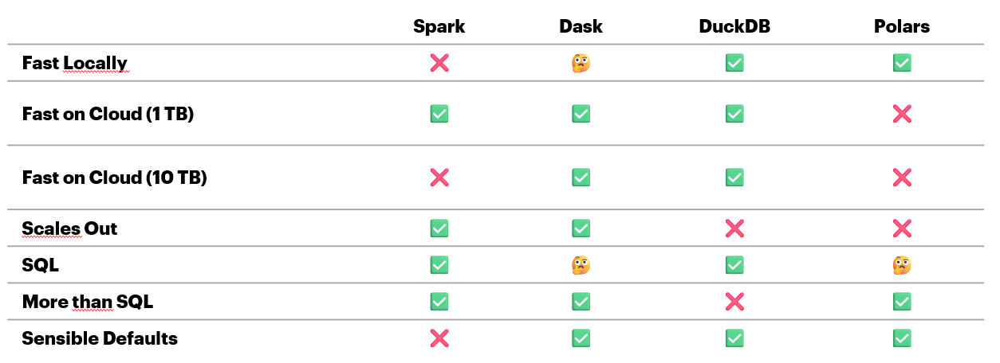
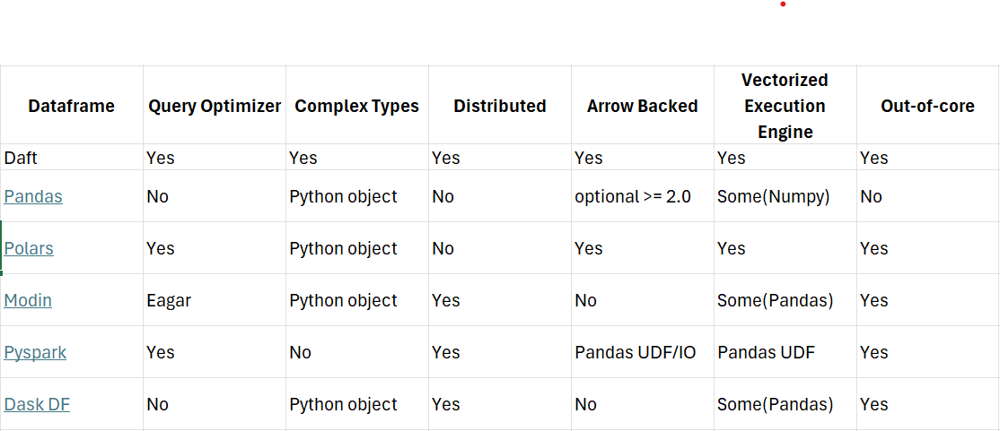
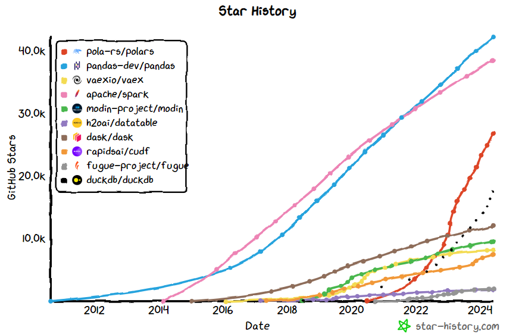
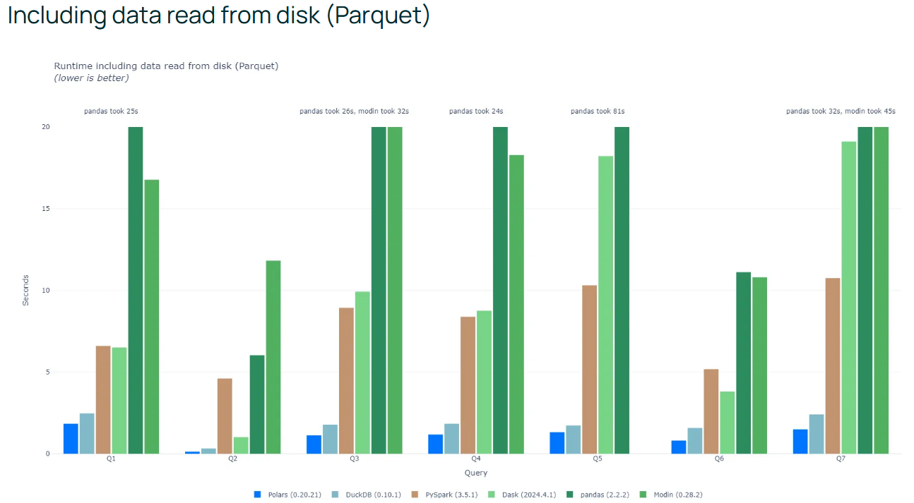

Performances & Choix du framework
=================================

Critères de choix
-----------------

Le choix du framework de gestion des dataframes est un choix clé qui doit être l'output d'une phase de cadrage technique.

Cette phase prendra a minima en compte les éléments suivants:

* la performance pure apportée par ce framework
* la capacité de scalabilité de ce framework sur différentes infrastructures
* le caractère populaire du framework en question
* la stratégie de la DSI

Documentation & Ressources
--------------------------

Comparaison des framework (Coiled)
^^^^^^^^^^^^^^^^^^^^^^^^^^^^^^^^^^

Source : `Coiled - Comparaison des frameworks <https://docs.coiled.io/blog/tpch.html>`_

Source : `Youtube - Dask DataFrame is fast now - Florian Jetter (Coiled) @ PyData <https://www.youtube.com/watch?v=yViaySnySy8&t=2852s>`_

Comparaison des framework (Kestra)
^^^^^^^^^^^^^^^^^^^^^^^^^^^^^^^^^^

Source : `Kestra Blog - Comparaison des frameworks <https://kestra.io/blogs/2023-08-11-dataframes>`_

Polars
^^^^^^

Polars est un framework de gestion de dataframes en Rust, qui propose une API en Python. Il est de plus en plus populaire et est utilisé par de nombreuses entreprises.

Source : `https://star-history.com/ <https://star-history.com/#pola-rs/polars&pandas-dev/pandas&vaexio/vaex&apache/spark&modin-project/modin&h2oai/datatable&dask/dask&rapidsai/cudf&fugue-project/fugue&duckdb/duckdb&Date>`_

Polars est un framework très performant, comme le montre les benchmarks suivants :

Source : `https://pola.rs/posts/benchmarks <https://pola.rs/posts/benchmarks/>`_

`Pycon 2023 : Lightning fast dataframes with Polars <../../../rss/pdf/pycon2023-polars.pdf>`_

Choix retenu
------------

.. important::

  Le modèle ALM d'Accenture est réalisé via polars, pour les raisons suivantes :

  * performance apportée par Polars en local
  * capacité de parallélisation de Polars (CPU aujourd'hui, GPU bientôt)
  * lisibilité / expressivité du langage
  * prise en main rapide

