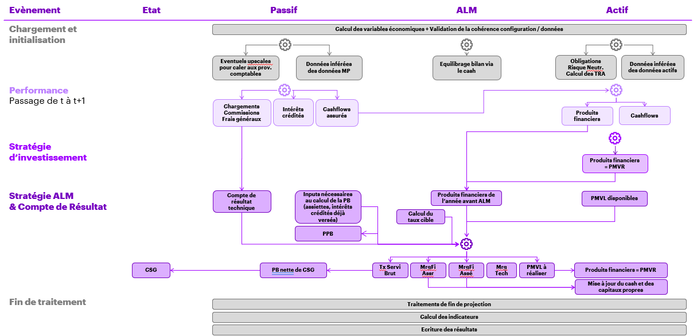

Prisme d'implémentation & Maintenabilité
========================================

Prisme d'implémentation
-----------------------

Ci-dessus une desciption générale d’un modèle ALM.

Le prisme d'implémentation retenu consiste à impacter un "état de la société" par différents transformations / évènements.

Ce prisme permet notamment :

* une compréhension rapide du modèle et des transformations induites par les différents évènements
* d’identifier rapidement le code à impacter lors d’évolutions du modèle
* d’implémenter et tester l’impact des différents évènements de manière indépendante

Conception générale & Gestion des métadonnées
---------------------------------------------

La construction de modèles actuariels nécessite la gestion d’un nombre important de variables, réutilisées au sein d'un nombre important de dataframes.

A des fins de maintenabilité, il convient de définir et de garder une vision claire dans le temps :

* des dictionnaires de données
* des formats des dataframes manipulés de bout en bout
* de l'orchestration des traitements dans le cadre du modèle ALM